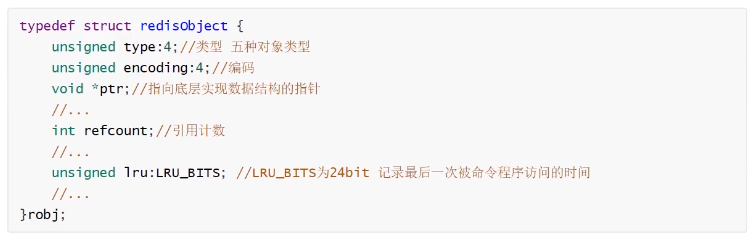

### 缓存原理以及设计

#### 为什么要有缓存?

因为数据库是使用磁盘 io 的,并且有锁,速度慢. 缓存可以减轻数据库压力,访问速度快,提高用户使用体验.

#### 缓存使用场景

1. 减轻数据库压力
2. 提高系统响应
3. 做 session 的分离
4. 分布式锁(悲观锁(直接先锁),乐观锁(版本控制))

redis 写 8w 并发没问题,读 11w

#### 缓存原理

利用内存存储数据,保存经常访问的内容或者是要求速度但是重要性不高的内容.也是计算机组成原理中cpu 上的缓存的引申.(核心思想: 空间换时间)

#### 常用缓存以及分类

1. 客户端缓存(页面缓存,浏览器缓存,app 缓存)
2. 网络端缓存(web 代理缓存nginx(静态资源缓存), cdn缓存)
3. 服务端缓存(数据库级缓存(mysql InnoDB, key-v),平台级缓存(guava-cache,caffeine 等),应用级(中间件等)缓存(redis, memcached等))

#### 服务器端缓存详细

#### 缓存优缺点

##### 优点

1. 提升系统响应能力, 大大提升了用户的体验
2. 减轻应用服务器压力和服务器压力
3. 提升了系统性能

##### 缺点

1. 额外的硬件支出
2. 提升了系统复杂度以及带来了一些问题(缓存穿透/雪崩/击穿, 数据不一致问题(缓存和数据库, 主从数据不一样))
3. 缓存并发竞争

#### 缓存的读写模式

##### Cache Aside Pattern

```flow
s=>start: Start
op1=>operation: 写请求
op2=>operation: 更新数据库
op3=>operation: 删除缓存
e=>end: End

s->op1->op2->op3->e
```

##### 为什么要删除缓存而不是更新缓存呢?

###### 操作方面

1. 缓存需要遍历,需要时间
2. 懒加载思想, 使用的时候再统一更新缓存
3. 或者是异步的方式去更新填充缓存, 后台线程或者是消息来处理缓存
4. 高并发下减少脏读现象(但是现在也还是会有这种情况)

###### 并发方面(脏读)

1. 先更新数据库,再更新缓存(两个线程相隔时间很短,第二个线程数据库上覆盖了第一个,但是缓存上第一个覆盖了第二个,这样就有可能导致老数据被读走了)
2. 先更新缓存,再更新数据库(更新数据库的时候宕机了,这样就会导致数据库还是老的数据而缓存中是新的.从而导致数据不一致的问题出现.而且肯定需要保证数据库的优先级高于缓存)
3. 先删除缓存,再更新数据库(这个方案问题更大.比如 A线程要更新数据,先删除了缓存,然后 B线程来读,但是由于 A 线程还没有进行 commit.所以 B 线程会用老的数据并且写入缓存.这样就会导致缓存变成老的.)
4. 先更新数据库,再删除缓存(虽然主从同步会存在数据不一致的问题.但是可以保证数据最终的一致性.采用延时双删策略)

##### Read/Write Through Pattern(需要缓存支持)

应用程序只操作缓存,缓存操作数据库.

1. Read-Through (读穿透模式/直读模式), 应用程序读缓存,缓存没有,由缓存回源到数据库,并写入缓存.(guava-cache)
2. Write-Through (写穿透模式/直写模式), 应用程序先写入缓存,缓存写数据库(redis 不支持)

这种模式需要提供数据库的 handler,开发十分复杂.

##### Write Behind Caching Pattern(需要缓存支持)

应用程序只更新缓存.缓存通过异步的方式将数据批量或合并以后更新到 db 中.
不能做到实时同步,甚至会丢数据

#### 架构设计

1. 多层次(客户端/网络端/服务器端), 页面, 负载均衡,nginx, tomcat,数据库集群.保证分布式缓存挂了,本地缓存还可以使用.
2. 在 value 是简单数据类型(字符串,整数,二进制等.并且value 比较大(100k)), 只进行 setter,getter.那可以考虑使用 memcached, 因为 memcached 纯内存缓存,多线程
3. 单机靠不住,做集群. redis: 哨兵+主从, redisCluster, codis
4. 缓存的数据设计
  
   - 缓存中与数据库表一致的数据(热数据/冷数据),缓存存储少一些的字段信息,少一点的数据量.只存放经常使用到的内容即可
   - 与数据库表不一致(为了取得方便,对数据库上的数据根据业务做一个聚合或者其他的逻辑).比如用户发帖子.帖子是table.但是使用上需要根据 user 做一个聚合.

##### 详细分析


前端页面如果是动态的.不能采用静态 html,使用模板技术(从后端获取数据再进行渲染).
数据库异步刷新redis 缓存.请求不会直接透传到 db.
对于一些使用频繁修改又少的内容,直接使用本地缓存(guava-cache),并且支持高并发访问.(json/xml 直接存储在项目本地)
对于热点数据,不必要做到实时变化.但一定要保证稳定性,一定要有数据.(新数据没拿到,可以使用老的应用上的缓存.取到了,再更新应用上的缓存,返回缓存),客户端可能看到的数据不一致;但是第一稳定性好.第二,可以保证最终一致性.

##### 针对上个案例

目的是为了保证稳定,能够接受数据不实时.如果是要保证数据实时放弃稳定性,可以采用熔断策略.

### Redis 详细介绍

redis 是 C 语言编写的.
key 为字符串.
value 使用的数据类型
常用: string, list,set,sortedset(zset), hash 类型
不常用的: bitmap 位图类型, geo 地理位置类型. redis 5 中新增一种,stream 类型.(消息队列)

需要注意的是 redis 的命令忽略大小写, 但是 key 是不忽略大小写的.

#### key 的设计

1. 用":"进行分割
2. 表名作为 key 的前缀; eg: item:
3. 第二段放主键值
4. 第三段放列名

=> 表名 :id :列名(属性名)
比如 item :100 :Sofa

这样做的好处在于,表示明确,看 key 知道意思,而且不容易被覆盖.

#### 常用数据类型

##### String 字符串类型

redis 中通过 string表达三种类型. 字符串,整数,浮点数.

常见命令:

|命令|command example|描述|
|---|---|---|
|set|set key value|赋值|
|get|get key value|取值|
|getset|get set key value|取值并且赋值|
|setnx|setnx key value|当 value 不存在的时候采用赋值,存在不赋值并且返回值不一样. set key value NX PX 3000 原子操作, px 设置毫秒数(常用于分布式锁)|
|append|append key value|向尾部追加值|
|strlen|strlen key|获取 key 的长度|
|incr|incr key|递增数字(常用于乐观锁, watch 事务)|
|incrby|incr key by increment|增加指定的整数|
|decrby|decr key|递减数字|
|decrby|decr key by decrement|增加指定的整数|

##### List 列表类型

List 是双向列表(quick list), 最多可以 2^32-1
左侧插入,左侧取出.就可以当做是栈来使用.
左侧插入,右侧插入.就可以当做是队列来使用

粉丝列表,评论列表. 利用 lrange读取某个区间的内容,可以实现分页功能.
基于是有序的数据结构,还可以用作消息队列.(lpush + brpop)实现.

|命令|command example|描述|
|---|---|---|
|lpush|lpush key v1 v2 v3...|从左侧插入列表|
|lpop|lpop key|从列表左侧取出|
|rpush|rpush key v1 v2 v3...|从右侧取值|
|rpop|rpop key|从列表右侧取出|
|lpushx|lpushx key value|将值插入列表头部|
|rpushx|rpushx key value|将值插入列表尾部|
|blpop|blpop key timeout|从列表左侧取出, 列表为空时阻塞.设置最大阻塞时间,单位为秒|
|brpop|brpop key timeout|从列表右侧取出, 列表为空时阻塞.设置最大阻塞时间,单位为秒|
|llen|llen key|获得列表中元素个数|
|lindex|lindex key index|获取列表中下表为 index 的元素,从 0 开始|
|lrange|lrange key start end|返回列表中指定区间的元素, 区间通过 start和 end 指定|
|lrem|lrem key count value|删除列表当中与 value 相等的元素.当 count>0, 从左边开始删除. count<0, 从右边开始删除.当 count=0 时,lrem 删除所有值为 value 的元素|
|lset|lset key index value|将列表 index 位置的元素设置成 value 的值|
|ltrim|ltrim key start end|对列表进行修剪,只保留 start 到 end 的区域|
|rpoplpush|rpoplpush key1 key2|从 key1 列表右侧弹出,并插入到 key2 列表左侧|
|brpoplpush|brpoplpush key1 key2|从 key1 列表右侧弹出,并插入到 key2 列表左侧.会阻塞|
|linsert|linsert key BEFORE/AFTER pivot value|将 value插入到列表且值位于 pivot 之前或者之后|

##### Set 集合类数据

Set: 无序, 唯一元素
集合中的最大成员数2^32-1
适用于不重复且不需要顺序的数据结构.
eg: spop 进行随机抽奖. sinter 共同好友列表等. 并且由于在分布式下可以利用 redis 做到全局去重.

|命令|command example|描述|
|---|---|---|
|sadd|sadd key mem1 mem2 mem3...|往集合中添加新的成员|
|srem|srem key mem1 mem2|删除集合指定成员|
|smembers|smembers key|获得集合中所有元素|
|spop|spop key|返回集合中的一个随机元素并且删除|
|srandmember|srandmember key|返回集合中的一个随机元素,但是不进行删除|
|scard|scard key|获得集合中元素的数量|
|sismember|sismember key member|判断元素是否在集合内|
|sinter|sinter key1 key2 key3|求多集合的交集|
|sdiff|sdiff key1 key2 key3|求多集合的差集|
|sunion|sunion key1 key2 key3|求多集合的并集|

##### SortedSet(zset) 有序集合类型

有序集合: 元素本身是无序不重复的
每个元素关联一个分数(score), 可以按照分数进行排序,分数是可以重复的
由于可以按照分值排序,适用于各种排行榜.点击排行榜,销量排行榜,关注排行榜

|命令|command example|描述|
|---|---|---|
|zadd|zadd key score1 mem1 score2 mem2 score3 mem3...|往集合中添加新的成员|
|zrem|zrem key mem1 mem2|删除集合指定成员|
|zcard|zcard key|获得集合中元素的数量|
|zcount|zcount key min max|返回集合中 score 值在[min, max]之间的元素|
|zincrby|zincrby key increment member|在集合的 member 分数上加 increment|
|zscore|zscore key member|获得集合中 member 的分值|
|zrank|zrank key member|获得集合中 member 的排名(按分值从小到大)|
|zrevrank|zrevrank key member|获得集合中 member 的排名(按分值从大到小)|
|zrange|zrange start end|获得集合中指定区间成员,按分数递增排序|
|zrevrange|zrevrange start end|获得集合中指定区间成员,按分数递减排序|

##### Hash 类型

类似于一个 Map 的结构. 可以存放类似于对象的内容,但是不支持嵌套. 因为现在场景比较复杂.使用上来说,还是不是那么常用.
常用于: 对象存储.数据表的映射

|命令|command example|描述|
|---|---|---|
|hset|hset key field value|赋值,不区别新增还是修改|
|hmset|hmset key filed1 value1 field2 value2|批量赋值|
|hsetnx|hsetnx key field value|赋值,如果 field 存在则不操作|
|hexists|hexists key field|查看某个 field 是否存在|
|hget|hget key field value|获取一个字段值|
|hmget|hmget key field1 field2|获取多个字段值|
|hgetall|hgetall key|获取 key 所有 field 的值|
|hdel|hdel key field1 field2|删除指定字段|
|hincrby|hincrby key field increment|指定字段自增 increment|
|hlen|hlen key|获得字段数量|

#### 不常用数据类型

##### bitmap位图类型

bitmap 是进行位操作的.
应用场景

1. 用户每月签到.用户 id 为 key,日期作为偏移量. 1 表示签到
2. 统计活跃用户,日期为 key,用户 id 为偏移量, 1表示活跃
3. 查询用户在线状态,日期为 key,用户 id 为偏移量, 1 表示在线.

##### geo 地理位置类型

根据geohash算法: 十进制转为二进制. 交叉后得到六位数编码. Z 阶曲线.然后通过 base32 进行编码变成一个编码.
放入 zset 中, value 为 key, score 为 52 位整数.根据 score 排序就可以得到坐标附近的其他元素.将 score 还原成坐标值,就可以得到元素的原始坐标.

用于: 记录地理位置,计算距离,查找"附近的人"

```sh
geoadd
geohash
geopos
geodist #计算成员间距离
georadisbymember #根据成员查找附近的成员
#eg 获取小明20 公里内最近的三个成员
# withcoord 获取经纬度
# withdist 获取距离
georadiusbymember user:addr xiaoming 20 km withcoord withdist count 3 asc 
```

##### stream 数据类型

stream 是 redis5.0 后面新增的数据结构. 用来做消息队列的. (比较不常用,都会使用更加专业的消息队列)

### Redis 数据结构底层


redisObject 关联实际存储类型的指针.

redis 没有表的概念.用 db 编号进行区分.初始化会带 16 个,0-15 中.在 redis.h 中定义.
所有数据库保存到结构为 redisServer 的一个成员 redisServer.db 数组中.
在 redis client 中有一个 db 的指针指向当前使用的数据库.


#### RedisObject



通过 type 和编码决定不同的类型.
4 位,type key(查看 value 的类型).
4 位,object encoding key(查看编码方式)
24 位,lru 存储的是对象最后一次被命令程序访问的时间.lru: 高 16 位,最后被访问时间; lfu:最近访问次数.利用的是后面8 位来存储访问次数.共用一个字段.
refcount, 被引用的次数. 共享对象;整数.
ptr, 指针指向具体的数组.

##### 七种 type(sds(数组+长度),skiplist,hashtable,dic,intset,quicklist,stream)

###### SDS(Simple Dynamic String)

redis 使用了 SDS(Simple Dynamic String) 用于存储字符串和整型数据.


为什么要单独使用 sds 而不用 c 的字符串数组呢?

1. 单独维护了 len free,方面计算长度.(len+free+1)
2. 记录了长度,所以可以通过这个点来避免造成缓冲区溢出避免自动重新分配内存.
3. 相比 c 可以存取二进制数据和空字符串.(以 len 字符串长度来标识结束标识) sds: 非二进制,以\0结尾.二进制按照字符串长度作为结尾.

> 常用于: 存储字符串和整型数据.存储 key, AOF 缓冲区以及用户输入缓冲

###### 跳跃表(skipList), 重点

有序集合的底层实现(zset). 效率高,实现简单(但是相比树占用内存更多)
**基本思想: 将有序链表的部分节点分层,每一层都是一个有序链表**

多层链表的结构.
**查找时**,从高层找.当到达某个节点的时候, 进行判断如果 next 找到的值大于或者next指针为 null, 进行降级.(说明跳过了或者没有)
为什么要是 next? 判断是不是在这个区间.即当前 node 和下个 node 的区间中.类似于一个这样的概念来思考的.
也是典型空间换时间的思想.有点类似红黑树,但是实现上简单很多了.在并发环境下插入删除,因为不存在 rebalance,相比红黑树需要的锁更少,所以性能上会更好.

**插入时**, 可以通过模拟 1/2 的概率的方式来决定新插入节点跨越的层数.(因为隔一个跳从效率上来说是最高的)

**删除时**, 每层上对应的被删除元素都要删除.(查找的次数接近于层数)

空间基本上翻了一倍.

###### 字典(dic), 重点+难点

字典是用来存储数据的容器,通过头指针+偏移量能够以 O(1)的时间复杂度定位到数据所在的位置.快.

通过 Hash 散列,把任意长度的输入(key),转换成固定类型,固定长度的三劣质.
redis-cli: times 33 算法
redis-server: siphash 算法
通过的是链式地址法来处理 hash 冲突. 查询的时候找到列表以后再进行遍历找到需要的 key. 新来的 key 会插入在前面(新的可能访问程度比较高,并且插入比较快)

###### Redis 字典的实现

redis 字典的实现包括,dict, hash 表(dictht), hash 表节点(dictEntry)
dict 中有两个 hash table. 用于扩容的使用.ht[0]为原生的 hash 表,hash[1]是 rehash 表. 并且上面有 rehash 的标识(-1)代表没有在进行 rehash.


1. hash 表的初始值为 4. 每次扩容为当前的一倍.
2. 索引值=hash 值&掩码值

hash 表节点中存储了各个类型的值.形成的是单向链表.

dict 除了数据库 k-v 数据存储意外,还可以用于散列表对象,哨兵的主从节点管理. 各个应用场景向, dict 的 type 都不一样.


rehash=0 标识要进行 rehash 了. 新数据肯定在 ht[1]中,老的可能在 ht[0]也可能在 ht[1]中.**在 rehash 过程中,修改删除查询都在老的 hash[0]**所以 redis会采用渐进式 rehash, 忙的时候rehash 的节点比较小,空闲的时候批量 rehash

###### hashtable

在 dic 中有介绍

###### 压缩列表(ziplist)


压缩列表的主要作用就是为了节省内存.

应用场景:

1. zset, hash 元素个数少且是小整数或者是短字符串.(直接使用)
2. list 用quicklist 数据结构存储, 而快熟链表底层是由双向列表加上压缩列表的组合(间接使用)

###### 整数集合(intset)

intset, 存有序的连续存储.
当 redis 集合类型的元素都是整数且都在 64 位有符号整数范围内,使用 intset


###### 快速列表(quicklist)

之前是由(3.2 之前)adlist+ziplist 来实现, 后面单独实现了一个 quicklist(双向链表+quicklistLZF(压缩算法,数据与前面重的记录重复,只记录位置和长度,不记录原始的数据)).

通过双向链表完成一个数据结构可以用于队列或者栈.获取头尾都是O(1)的复杂度,并且 redis 实现上记录了长度,len 的计算也为O(1).


应用场景:

1. list 的底层实现
2. 发布订阅
3. 慢查询
4. 监视器

###### stream

listpack(紧凑列表) + rax 树(有序字典树(按照字母排序,能够在读取的时候把内容给读出来))

应用场景:

1. steam 实现

##### 10 种 encoding

String: int,raw(大字符串, >44),embstr(压缩字符串,<44 字节)
List: quicklist
hash: ziplist(小整数或者短字符串(ziplist)),hashtable-dict(个数多或者元素不是小整数,短字符串)
set: intset,dict(大于 2^64)
zset: ziplist(小整数或短字符串), skiplist(大整数或短字符串)

### Redis 缓存过期和淘汰策略

redis物理内存达到上限后,也会进行 swap(虚拟内存).因为频繁 IO 会导致性能下降

#### maxmemory

maxmemory默认为 0
物理内存的 3/4 左右.

#### 不设置的场景

redis 的数据是固定的.不会增加(字段库). redis 作为 db 使用,保证数据的完整性,不能淘汰,可以做集群,横向扩展.
eg: 如果字典库设置了比较小的 maxmemory,且淘汰策略淘汰数据比较多.那么当请求打过来的时候,全打到 db 上就出问题了(缓存击穿)
这时缓存淘汰策略为: 禁止驱逐(默认)

#### 设置的场景

redis.conf中进行设置.(config get maxmemory)
作为缓存使用,key 不断增加
> 设置多少合适? 物理内存的3/4,至少保证系统有 1G 去运行
还需要配置 maxmemory-policy(淘汰策略)

##### expire 命令

expire key ttl(time-to-live)(秒),这时 key 的过期时间

> 原理: redisdb 维护了一个 redis 数据库中所有的 key-value,然后还有一个 expires 的表,里面存放的 key和失效时间. 当我们插入数据到这个 redis 数据库中,expires 表里面也会插入.


两种设置方式:
expire key ttl(seconds)(非原子)
set key value PX ttl(毫秒)(原子策略)

#### 删除策略

redis 现在采用的是惰性删除+主动删除两种方式

选择:

- allkeys-lru, 一般采用策略(冷热交换)
- volatile-lru, 性能比上面的差一点(但是不会删除没有设置过期时间的数据)
- allkeys-random, 希望符合平均分布
- volatile-ttl (通过自己设置的 ttl 来驱逐)

##### 定时删除(不用)

在设置 key 的时候,创建一个定时器,让定时器在 key 过期的时候删除 key.

需要设置定时器,而且消耗 cpu,不推荐使用

##### 惰性删除

在 key 被访问的时候如果发现已经失效,删除他.
redis 底层函数,expireIfNeeded(读数据之前先检查是否失效,如果失效了就删除)

##### 主动删除

redis.conf 中心进行配置(默认是 no-enviction)

> maxmemory-policy allkeys-lru

allkeys-lru 从数据库中挑选最久没被使用的数据进行淘汰
volatile-lru 从设置过期时间的数据集中挑选最久没被使用过使用的数据进行淘汰

allkeys-lfu 从数据库中挑选最少使用的数据进行淘汰
volatile-lfu 从设置过期时间的数据集中挑选最少使用的数据进行淘汰

volatile-random
allkeys-random
随机淘汰

volatile-ttl 从设置过期时间的数据集里面随机挑选要过期的数据(选出来以后选择里面 ttl 最小的进行淘汰)进行淘汰

noenviction 禁止删除数据

###### LRU (Least recently used 淘汰冷数据)

最常见的实现是用链表保存缓存数据.(如果被用到,就移到头部. 链表满了,将链表尾部的数据丢弃, java 中可以使用 LinkHashMap 来实现)

最久没被访问的key 被淘汰(时间判断,redis 中高 16 位判断)

###### LFU(Least frequently used)

最不经常使用

### Redis 通信协议以及事件处理机制

单进程单线程.基于 tcp 全双工的模式.

#### 请求响应模型

##### 串行模式(ping-pong)

tcp 长连接. 通过心跳机制进行检测, ack 应答.

应用:

telnet
redis-cli

##### 双工的请求响应模式

批量请求, 批量响应. pipeline 交互模式穿插请求响应.


##### 原子化的批量请求响应模式(事务模式)

##### 发布订阅模式(pub/sub)

一个客户端触发,多个consumer 被动接收.通过服务器进行中转

##### 脚本化的批量执行(lua)

客户端向服务器端提交一个 lua 脚本,服务器执行

#### 请求数据格式

redis client 与 server 交互采用 resp(序列化协议) 格式
请求以字符串数组的形式表示要执行的命令参数.

##### 内联格式

telnet ip port
然后打命令即可

##### 规范格式(redis-cli)

redis-cli(aof 文件中可以查看)


符号后面跟着的是长度

##### redis 解析命令过程


#### redis 事件处理机制

Redis 服务器是典型的事件驱动系统.
将事件分为:

- 文件事件
- 时间事件

##### 文件事件

即 Socket 的读写时间,IO 事件.(file descriptor) 文件描述符
eg: 客户端的连接,命令,数据回复,连接断开

###### Socket

应用通过 socket 抽象层收发数据
通过多个线程管理多个 socket

###### Reactor 响应式

Redis 事件处理机制采用单线程的 Reactor 模式,属于 IO 多路复用(通过单个线程管理多个 Socket)的常见模式.

Reactor设计模式(通过事件驱动): 通过一个 Service Handler(对请求不做处理,只是dispatch),把请求通过消息发送出去,Request Handler 再进行处理.

好处在于不用对每个 socket 都创建一个 thread 进行管理.

###### 4 种 IO 多路复用模型与选择

- select(writefds, readfds, exceptfds)
- poll
- epoll
- kqueue

需要 OS 支持事件分离器(提供具体的实现)
I/O 多路复用就是通过一种机制,一个进程可以监听多个 socket,一旦某个 socket 就绪,能通知对应的程序进行相应的读写操作.

redis 中大多是采用 epoll 实现方式

---
select:

调用 select 函数会阻塞,直到有 fd 就绪(可读,可写或者 except 出现),或者超时(timeout),函数返回. 当 select 函数返回后,可以通过遍历 fd 列表找到就绪的 jd.

优点: 所有平台几乎都支持,良好的跨平台支持
缺点: 单个进程打开fd 是有限制的,默认是 1024, 由 FD_SIZE 设置.另外查询 fd数组中是否有fd 需要读写,采用的是线性扫描方法,轮询,效率比较低

---
poll:

使用 pollfd 的指针实现,pollfd 包括了要监视的 event 和发生的 event.

优点: 采用链表存储,不再有 fd 的限制. 可以超过默认的 1024.
缺点: 线性扫描,效率低

---

epoll(linux2.6.8版本才提供):

1. 使用共享内存,不用做内存拷贝.
2. 在注册的时候就要标明你要监听哪个 fd.(不用做轮询)
3. 并且没有最大并发连接的限制.

epoll_create 创建 epoll
epoll_ctl 创建事件
epoll_wait 等待处理

---

kqueue 是在 unix 下的多路复用库.(unix 下)

注册批量,批量通知,效率更高

###### 文件事件分配机制


redis 在主循环中,统一处理文件事件和时间事件,信号事件交给专门的 handler 进行处理

##### 时间事件

分为定时事件与周期事件.

id(全局唯一)+when(时间事件的到达时间)+timeProc(时间事件处理器,当时间到达了,redis 调用相应的处理器进行处理) 三个属性组成.

aeTimeEvent(单向链表结构)

###### serverCron函数

redis 服务器中需要对自身的资源以及配置进行定期的调整.这些操作由 serverCron 函数完成.

1. 更新 redis 各类统计信息
2. 清除过期数据
3. 关闭和清理连接失败的 client
4. 尝试进行 aof 和 rdb 持久化操作
5. master 定期向 slaverr 进行同步
6. 集群模式下对集群定期进行同步与连接测试

默认1s 执行 10 次, 100ms一次.可以在 redis.conf 中进行配置(hz 选项,一秒内执行的次数),调整执行周期

###### 定时事件

到达时间执行一次后删除

###### 周期性事件(serverCron 典型的周期性事件)

每隔一段时间就执行一次.执行完以后更新 when,保证下一次继续执行

###### aeEventLoop

事件驱动的核心. redis 实现了自己的事件处理机制. 管理文件事件表和时间事件表.不断循环处理就绪的文件事件和到期的文件事件.


在服务器初始化的时候创建事件管理器(aeEventLoop)

1. 创建 event 对象
2. 注册文件事件列表(aeFileEvent, aeFiredEvent)
3. 初始化时间事件列表(aeTimeEvent,双向链表.)
4. 调用 aeApiCreate 函数创建 epoll 实例(apiData/aeApiState 决定,根据操作系统选择不同的实现)

根据不同的系统选择不同的事件分离器的实现.

###### aeProcessEvent 函数

事件处理的实际函数.先去计算哪些时间事件要到达了(如果有就处理,没有就去处理文件事件),然后去处理就绪的文件事件,然后再处理到达的时间事件. 通过这种方式更加利用好时间

### Redis 持久化

Redis 是内存数据库. 在 Redis宕机以后,为了避免缓存血崩导致请求直接穿透到 db 中,为了快速恢复数据(不是为了存储数据,不保证数据的完整性)才有了持久化.
如果是做 db 的情况下, redis 一定要有一个完整的数据源,在系统启动时将数据load 到 redis 中.(数据量小,不会经常改变)

持久化有两种 RDB,AOF 两种方式.可以通过 info 命令查看持久化的信息(persistence 下). 默认 rdb 开启,aof 不开启.

**对比:**

---
数据以及性能上:

rdb: 二进制存储,性能更快. 丢失数据上,可能会丢掉两次保存之间的数据. rdb 在master 上保存时,过期 k-v 不会保存.salve 上会保存,同步的时候清除.
aof: 文本保存,性能相对较慢. everysec 保存模式下,最多丢失2s 以内的数据. 过期的内容会追加一条 del 命令,重写的时候就忽略过期 key 和 del 命令.

---
应用场景上:
内存数据库 rdb+aof 数据不容易丢. 如果有原始数据源, 则不用开持久化
缓存服务器: rdb 一般性能高.(如果数据大需要处理,避免 fork 导致性能下降或者开 aof)

---
数据还原上:
优先 aof(数据完整). 如果只有 rdb 则还原 rdb

#### RDB(Redis Databse)

在 redis.conf 文件中可以看到. 通过快照完成的.不关注过程,只关注当时的数据.
默认在dump.rdb保存(二进制文件).

优点: 二进制压缩文件,占用空间小,便于传输.(传给 slaverr)
缺点: 不保证数据完成性, 如果最后一次快照丢失,最后一次快照和倒数第二次快照之间的更改都会丢失.

##### 触发快照的方式

1. 符合自定义配置的快照规则
2. 执行 save 或者 bgsave 命令
3. flushall 命令
4. 执行主从复制操作时(第一次)

##### 配置参数定期执行(自定义配置)

在 redis.conf 中配置. save [seconds] [changes]

```sh
save "" # 不使用 RDB 存储, 不能主从
save 900 1 # 表示 900 秒内至少一个key 被更改过就执行快照
save 300 10 # 500s 内, 10 个key 被修改了触发
save 60 10000 # 60s 内至少 10000 个 key 被更改执行

漏斗设计,提高性能(可以配置多个)
```

##### bgsave 流程


父进程 fork 的时候会阻塞,fork 完了就正常处理请求了. 所以在数据量比较大的时候,redis 会被阻塞从而导致访问缓慢.这个时候就要看 bigkey 或者需要更频繁的缓存淘汰策略等来控制数据量的大小.

#### AOF(Append only file)

redis 默认是不开启的.aof 会记录过程(resp 的格式记录你的操作和数据,存放在.aof 文件中.默认 appendonly.aof,redis.conf 中可以进行配置).

##### AOF 原理

AOF 存储的是 redis 的命令. 同步命令到 aof 文件中分为三个阶段

1. 命令传播: redis 将执行完的命令, 命令参数以及参数的个数等信息发送到 aof 程序中.
2. 缓存追加: aof 程序根据接收到的命令数据,将命令数据转化为 resp 格式并且追加到 aof 文件当中.
3. 文件写入和保存: aof 缓存中的命令会被写入到 aof 文件末尾(write). 如果设定的aof 保存条件满足下, fsync 函数或者 fdatasync 函数被调用,保存 aof 缓存中的数据到磁盘中(save).(fsync 和 fdatasync 都是操作系统级别的函数.)


##### AOF 保存模式

AOF_FSYNC_NO 不保存
AOF_FSYNC_EVERYSEC 每秒保存一次
AOF_FSYNC_ALWAYS 每执行一个命令保存一次

###### 不保存

在这种情况下,只会 write aof 缓存文件.不会保存到实际文件中.

save 操作只会在才会被触发:

1. redis 被关闭
2. aof 功能被关闭
3. 系统的写缓存被刷新(写缓存满了或定期保存操作)

这三种情况都会引起 redis主进程阻塞.

###### 每秒保存一次(推荐), 最多丢失 2s 的数据

保证 save 操作,每秒钟 执行一次. 因为 save 操作是由 redis 后台子线程调用的,不会引起redis 主进程阻塞.

###### 每个命令执行保存一次, 最多丢失一次命令的数据

每次命令执行完就执行一次. write 和 save 都会执行. 另外由于此时 save 是主进程执行的,所以主进程会被阻塞,不能接受命令请求

##### AOF 重写

AOF 重写, 为了避免 aof 越来越大,需要重写来减少文件大小.
AOF 重写会自动在后台 fork一个子进程来对 aof 进行重写.(实际上是通过当前 db 的状态以及 aof 文件中的命令来优化 aof 记录的内容)

```sh
set s1 11
set s1 22
set s1 33 
# 会被优化为
set s1 33
```

> 子进程处理的好处在于不会阻塞到主进程继续执行命令.但是也同时带来了一个问题,因为主进程现在还在继续处理命令,所以会导致子进程里面的数据和主进程的数据不一致.为了解决这个问题, redis 设计了一个机制: **aof 重写缓存**在主进程接收到新的写命令之后,除了会将这个写命令内容追加到现有的 aof 文件之外(没瘦身的文件),还会追加到这个写缓存中去.

通过这个机制,可以保证子进程新生成出的 aof 文件可以和老的 aof 文件保持一致.(子进程写好新的 aof 文件以后,会通知父进程(信号),父进程再将新的 aof 文件覆盖老的 aof 文件). 保证了数据的安全性.即便在重写过程中,redis 宕机, aof 文件也不会丢失数据.

在这整个过程中,除了最后的写入缓存和改名操作会造成主进程阻塞,其他的时候 aof 后台重写都不会对主进程造成阻塞.这样极大的降低了 aof 重写对主进程造成的影响.

###### aof 触发配置

- redis.conf 中配置

```sh
# 新的 aof 超过上次 aof 大小百分比多少的时候会进行重写
auto-aof-rewrite-percentage 100
# 限制允许重写的最小 aof 文件大小, 小于<64mb 的文件不需要进行优化
auto-aof-rewrite-min-size 64mb
```

- 执行 bgrewriteaof 命令

#### 混合模式

rdb 的头+ aof 身体(压缩+内容是 aof 的内容) -> appendonly.aof 文件中

```sh
aof-use-rdb-preable yes
```

#### AOF 文件的载入和数据还原

因为 aof 文件包括了恢复到原有状态的所有写命令.所以服务器主要读入这些命令并且执行一遍就可以恢复关闭之前的状态.

##### 读取 AOF 文件并还原的流程

1. 创建一个不带网络连接的伪客户端(不需要网络连接,因为来源于 aof 文件.需要营造一个客户端的上下文)
2. 从 aof 文件中分析并且读取出一条写命令
3. 使用 fake client 执行这个写命令
4. 反复执行 2,3 直到所有命令被处理完毕


### Redis 扩展功能

#### 消息订阅和发布

publish channel message 发送消息到某个 channel
subscribe 订阅某个 channel
unsubscribe 取消订阅某个 channel
psubscribe 批量订阅某些 channel,支持*等通配符
punsubscribe 批量取消某些 channel 订阅

应用场景:

1. 哨兵模式下主从同步
2. 分布式锁的释放

#### redis 事务(弱事务)

acid(原子性,一致性,隔离性,持久性)

redis 是弱事务性的. 不支持回滚
Atomicity: 在 redis 中,一个 commandQueue 中要么都执行要么都不执行
Consistency: 集群中不能保证时时一致性,只能保证最终一致性
Isolation: 事务之间不会互相影响.(在一个事务中,有可能被执行其他客户端的命令)
Durability: redis 有持久化,但是不保证数据的完整性

multi(开启事务)
exec (执行命令队列)
discard (清空命令队列)
watch (监控 key)
unwatch (清除监控 key)

这里 watch 不是那么好理解. 通过 watch 一个 key,我们可以把 key 里面的内容当做一个版本号.一个 client 执行:watch version:1, multi set name:1111, 如果别的客户端此时修改了 version,那么 multi 开启的事务在此时会清空命令队列, exec 返回为 nil.通过这种方式我们完成了乐观锁.

##### 事务机制

###### 事务执行

在 redis client 中,会有一个 flags 标明此时是否在事务中.如果是在事务中,那么除了事务的几个名另外,其他的命令都会被加入到 commandQueue 中.

###### Watch

watch的机制是 redis 会维护一个client -> watch key 的一个关系.如果 watch 的 key 被修改了,这些 client 的状态就会被标记为 dirty cas,然后如果此时发送exec 时,命令队列会被清空

##### Redis 弱事务性

前面 acid 的时候已经分析了.这里选择几个比较典型的来讲.

原子性中,某条命令在推送到队列的时候发现有语法错误,那么会给这个 client 标记为 dirty exec,在执行 exec 的时候就会报错(整个事务队列都会被清除). 如果是运行错误,比如往 string 当做队列来 lpush.(正确的命令会被执行)

所以体现出来的问题是部分命令被执行了,不满足我们的原子性.

> redis 不支持事务回滚. 原因: 为了性能忽略了事务回滚.大多数的事务失败是由于语法错误或者类型错误导致的,这个是可以人为避免的.

#### Lua 脚本

lua 是一个轻量小巧的脚本语言. 用 c 语言编写.目的是为了嵌入应用程序中,灵活的提供扩展和定制.

应用场景:

1. nginx使用 lua 实现高并发
2. OpenRestry 上
3. kong(OpenStack)
4. tengine(阿里)

> redis 2.6 版本已经内置了 eval 可以测试 lua 脚本的运行结果.

redis 使用 lua 的好处:

1. 绝对的原子性
2. 提供一定的逻辑扩展
3. 脚本的命令是可以复制的,redisServer 在获得脚本后不执行,生成标识返回,client 根据标识随时执行(sha1, evalsha sha1标识 参数)

##### eval 命令


> lua 中还可以调用 redis 的命令. redis.call()(出错了不继续执行也不记录), redis.pcall()(出错了会记录错误信息并且继续执行).
> 如果脚本中不写 return,返回的是 nil

##### evalsha 命令

script load "script content" (把 script 先加载到 redis server 中让他先编译好.不仅仅是减少传输数据,还减少了对脚本的编译.)

script flush 清除所有脚本缓存
script exists 根据 checksum,检查指定的脚本是否存在于缓存中
script load 加载 script 到缓存中
script kill 杀死正在运行的脚本

###### 通过 --eval 来执行lua 文件脚本

redis-cli -h host -p port --eval filename.lua keys , values (keys 和 values 中间的逗号两边需要有空格)

##### 脚本复制

redis 传播 lua 脚本的时候,在使用主从模式以及开启了 aof 持久化的前提下.
执行 lua 脚本, redis 服务器会有两种模式:

1. 脚本传播模式(默认)
2. 命令传播模式

###### 脚本传播模式

默认的传播模式. master 会把被执行的脚本以及参数复制到 aof 文件以及 salve 服务器中.

需要注意的是,在这个模式下执行的脚本不能有时间,内部状态,随机函数(spop)等.执行相同的脚本以及参数必须产生相同的效果.(目的是为了保证主从一致!). redis5 中,会在一个事务中执行.(加了 multi 和 exec)

###### 命令传播模式

在这种模式下,master 会将脚本所有的写命令用 multi (事务)包裹起来,然后写入到 aof 文件复制到 salve 中.在这个模式下,同步的是写命令,不会是脚本本身了.所以不再有脚本传播模式的限制.

为了开启命令传播模式,脚本需要调用一个函数,再写自己的逻辑函数:

```sh
redis.replicate_commands()
```

#### Pipeline, 事务以及脚本三者的区别

三个操作都是可以批量执行命令的.
pipeline 中,命令都是独立的,是无状态的操作.
事务和脚本,都是有原子性的,区别在于lua 脚本提供了更多的扩展性和逻辑性,并且原子性要强于事务(事务可能出现部分执行成功,部分失败)

#### 慢查询日志(调试分析用)

redis.conf 中可以配置慢查询.也可利用 config set 来临时设置,redis 重启以后失效. 底层使用列表来存储慢查询日志,fifo 队列模式

```sh
# 单位(milseconds), 执行时间超过多少的命令请求会被记录到日志上 0: 所有操作全纪录 <0 所有操作都不记录
slowlog-log-slower-than 10000 
# 存储慢查询日志条数
slowlog-max-len 128
# 默认是 10s, 最多记录 128 条, 记录 id,时间戳,执行命令的时长以及参数
```

slowlog get [n] 来查看慢日志(n 代表慢日志的条数)
slowlog reset 清空慢日志
slowlog len 查看慢日志条数

##### 慢查询定位&处理


#### Redis Monitor 监视器

通过 Monitor 命令科一将client 变为 redis 的监视器.
redis 内部维护一个列表,保存 redis monitors. 通过这个在master 写的时候,会将产生的命令发送到monitors 上.

### Redis 高可用

Redis 高可用有很多种方案.redis 是一个实现了 AP 的中间件.通过 slaverof or replicasof 来定义从服务器是属于哪个master.
后续也会将这个场景下带来的一个问题(主从数据不一致)

```sh
# salveof 127.0.0.1 6379
replicasof 127.0.0.1 6379
```

1. 一主一从
2. 一主多从
3. 传递复制(即 redis 一主多从的方案下,从服务器下还有从服务器)

#### 作用

1. 读写分离(一主多从,保证了主负责写,从负责读.达到读写分离), 提升 Redis 的性能以及吞吐量
2. 数据容灾(主机宕机了,从机还能保证可读.利用哨兵可以实现主从的切换,真正做到高可用)

#### 原理和实现

slaver 上保存了 master 的 host 和 prot, slaver 在启动以后发送一个SALVEOF 的命令收到 ok,表示复制指令已经被接收,实际复制工作会在 ok 返回后再执行.

##### 通过 socket 与 master 建立连接

slaver 可以接收 master 传来的 rdb 文件(全量复制)也可以接收 master 传来的写命令(增量复制).

权限校验: master requirepass slaver: masterauth

#### 主从同步的过程

##### 全量同步(sync psync)

sync:

1. 同步快照阶段(rdb)
2. 同步缓存阶段(同步阶段 master 的写 buffer)
3. 在同步 rdb 清空老的 rdb

重复上述 1,2, 带来的问题是,每次都是全量同步

---
5.0 psync:

1. 同步快照阶段(rdb)
2. 同步缓存阶段(同步阶段 master 的写 buffer)
3. 同步增量阶段

初次之外都是增量同步

##### 心跳检查

slaver 默认每一秒向 master 发送命令
replconf ack
主要作用有三个:

1. 检查主从连接的情况
2. 辅助实现 min-salves(min-replicas-to-write, min-replicas-max-lag) 至少几个从服务器,当服务器lag 都大于max 的时候, 主服务器拒绝写命令.
3. 检测命令丢失(发现从服务器里面的内容少了,会根据缺失的内容补上),网络不断

#### 哨兵模式

由一个或多个 sentinel 实例组成一个集群,监视 redis 集群.当redis master 出问题了, sentinel 会负责主从切换,保证 redis 的高可用.


master 切换后,sentinel 会更改 redis.conf 文件.更改主从关系.

### 使用场景面试题

#### 系统在某个时刻访问量剧增(热点事件),造成数据库压力剧增甚至崩溃怎么办?

#### 缓存雪崩, 缓存穿透, 缓存击穿

##### 缓存穿透: redis 缓存中没有,请求直接被打到了 db 上. db 连接不够导致 db 崩溃

解决办法:

- 查询结果不存在的值.(你原本不准备存,但是现在为了避免缓存穿透,你也存了)

> 缺点
> 费空间. 你不知道会有多少个没有返回值的情况出现. 
> 可能存在脏读, 比如你之前设置了为空写入缓存中. 后面有值了.你要么通过异步去更新 redis. 要么就把超时时间设置短点.

- bloomfliter, 在缓存之前加上一层 bloomfilter. 查询的时候先去 bloomfilter 中查询 key 是否存在,如果存在再查缓存和 db. 如果不存在直接返回.(思路是拆分成两个问题来考虑.)

二进制向量(bitmap) + hash 函数映射器

把字符串变成位 - 省空间
不用循环 - 省时间

> 可以通过多个 hash 函数来降低误判率. 把空值写入到 bloomfilter 中.

##### 缓存雪崩(大量的 key 突然失效)

同时大量 key 都失效了.(所有redis 瞬间宕机了)这些剩下的请求都打到了 db 上去.

解决办法:

1. timeout 上加随机时间.
2. 设置二级缓存(比如 guava cache 等)
3. redis 高可用(主从模式, sentinel,redis cluster)

##### 缓存击穿(少量的 key + 大量对这些 key 的访问)

少量的 key失效了,但是这些少量的 key 突然有大量的请求过来. 直接打到 db 上去了.(相比雪崩,这里 key 是少量的,但是是大量的请求.)

解决办法:

1. 分布式锁(把请求排队)
2. 热 key 不失效,失效策略设置为 volatile-lru(但是可能存在写不一致的问题,比如更新了 db,但是这边 redis 没更新(延时双删策略))

#### 缓存和数据库不一致会产生什么问题? 如何解决

缓存和数据库不一致的原因:

- 数据源不一致.
- 对数据的操作不是原子性的(db 更新的同时缓存更新)

强一致性很难,只能追求最终一次性(时间)
而互联网行业业务数据处理的特点(高吞吐量, 低延迟, 数据敏感性低), 像银行,交易所等可能就不能使用最终一次性.

##### 解决办法

延时双删策略:

1. 先更新数据库,然后删除缓存 key,等到读的时候再填充缓存(Cache Aside Pattern)
2. 2 秒后再删除一次缓存 key(避免之前的失败,或者是高并发下导致的脏读问题)
3. 设置缓存过期时间(保证删除失败后能够清理掉脏数据)
4. 将删除缓存失败的记录写入到日志中,日志监控系统提交失败记录再次删除.(解决第2 点中删除失败的情况, 3,4 一起保证)

升级方案:

mysql 中的 binlog,来异步淘汰key.利用工具,比如 canal 将 binlog 日志采集,然后发送到 mq 中. 通过 ack 机制确认一定删除缓存.(异步操作,每天定时删除)

#### 数据并发竞争会引起什么问题? 如何解决(并发导致顺序不一致)

多个客户端(不是同一个进程中的多线程,所以最好是分布式锁) set 同一个 key,顺序和业务想要的顺序发生了不一致的情况,导致设置的值不是想要的值.

解决方案(解决并发的顺序问题 将并发变成串行):

1. 分布式锁+时间戳(时间戳在这里充当乐观锁的作用)
2. 消息队列

#### hot key 产生的问题以及如何解决


流量太大,导致 redis 达到网络上限. redis 无限被请求冲崩溃.

解决办法(业务方向+技术方向):

##### 发现 hot key

1. 预估热 key(热点新闻, 热点大 v 等)
2. 在客户端进行统计,访问这个数据太多了
3. Proxy 模式的话在 Proxy 中进行统计
4. Redis 自带的命令, (monitor,hotkeys)不推荐使用,执行缓慢.
5. 利用大数据的流失计算技术来实时统计访问次数.

##### 处理 hot key

1. 变分布式缓存为本地缓存(guava cache), redis 访问超时读本地缓存
2. 在各个 redis master 节点上,进行 hot key 的备份(分散压力), 人为的对 hot key 加上一个值,让 hot key 分散到各个系统中
3. 对热点数据访问进行限流熔断保护措施

#### big key 产生的问题以及如何解决

value 值过大.
常见场景:

- 大 V 的访问列表,粉丝列表等
- 序列化的图片
- 热门话题下面的讨论

大 key 导致的问题

1. 占用过多的内存,在集群里面无法很好的平衡
2. redis 性能下降,主从复制容易出现问题
3. 主动删除或者过期删除的时候会导致操作时间过长引起服务阻塞

##### 如何发现 big key

1. redis-cli --bigkeys 命令(可以找到string, hash, list, zset, set)中的最大的 key.但是如果keys 过多,命令执行也会很慢
2. 获取 redis 的 rdb 文件,通过 rdbtools 分析 rdb 文件生成的 csv 文件,再导入数据库中进行统计.通过 size_in_bytes 统计 big key

##### 如何处理 big key

优化的原则就是减少数据量.string 减少长度, 集合减少成员.

1. string 类型的 big key. 尽量别直接存入到 redis 中,可以使用文档型数据库 MongoDB 或者缓存到 cdn 上. 如果一定要用 redis 存储,那尽量单独存储,别和其他的 key 一起存储.
2. 将对象进行拆分, 通过 mget 获取值.分拆,减少单次操作的压力,降低对 redis 的 IO 影响
3. hash, set, zset, list 中存储过多元素,将元素进行分拆(根据业务去拆分,活跃的放前面)
4. 删除big key 的时候不要用 del, del 是阻塞命令,删除时会影响性能(使用unlink 命令(通过先打断 key 和 value 的联系,value 在后台别的线程中进行删除))

#### 如何保证 redis 中数据都是热点数据

### 原理面试题

#### 单线程 redis 为什么这么快

1. 基于内存
2. 单线程,避免切换线程时造成的损耗
3. 多路复用 IO, 支持epoll(reactor 模型)
4. 数据结构设计的比较合适(压缩数据,跳跃表,数据结构中经常会有 size 呀等等冗余信息)

### 部署面试题

#### redis 哨兵模式和集群模式的原理以及选择

#### redis 在多机使用上,如何保证主从服务器数据一致性

RDB, AOF
